# Instalación de Nginx en Ubuntu

## Índice

- [Introducción](#introducción-1)
- [Comandos](#comandos-1)
- [Proceso](#proceso-1)

## Introducción-1

Nginx es un servidor web ligero y de alto rendimiento que también puede ser utilizado como proxy inverso. En el presente documento aprenderemos cómo instalar Nginx en un sistema Ubuntu.

## Comandos-1

A continuación, se presentan los comandos que se utilizarán en este proceso:

```bash
# Actualizar los repositorios del sistema
sudo apt update

# Instalar Nginx
sudo apt install nginx

# Iniciar el servicio de Nginx
sudo systemctl start nginx

# Habilitar Nginx para que se inicie automáticamente en el arranque
sudo systemctl enable nginx

# Verificar el estado de Nginx
sudo systemctl status nginx
```
## Proceso-1

1. **Actualizar Repositorios del Sistema:**
   Ejecuta el siguiente comando para asegurarte de que los repositorios estén actualizados.

   sudo apt update

   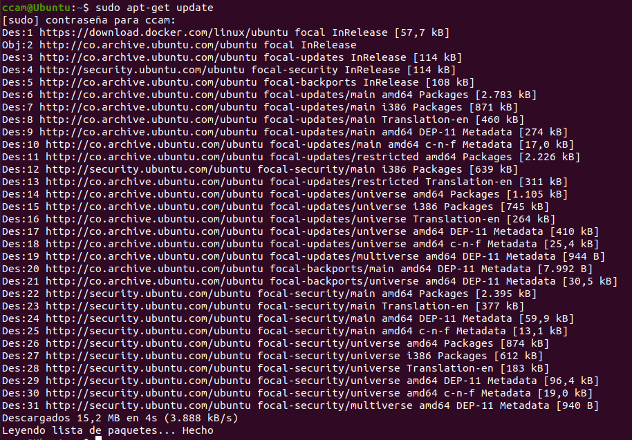

2. **Instalar Nginx:**
   Utiliza el siguiente comando para instalar Nginx desde los repositorios.

   sudo apt install nginx

   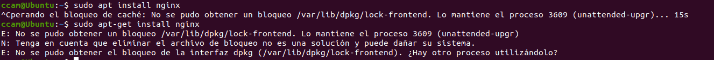

   en este caso ya se encuentra instalado.

3. **Iniciar el Servicio de Nginx:**
   Una vez instalado, inicia el servicio de Nginx.

   sudo systemctl start nginx

   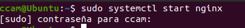

4. **Habilitar el Arranque Automático:**
   Para asegurarte de que Nginx se inicie automáticamente en el arranque del sistema, habilita el servicio.

   sudo systemctl enable nginx

   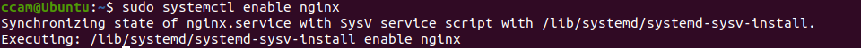

5. **Verificar el Estado de Nginx:**
   Puedes verificar el estado de Nginx para asegurarte de que esté en funcionamiento.

   sudo systemctl status nginx

   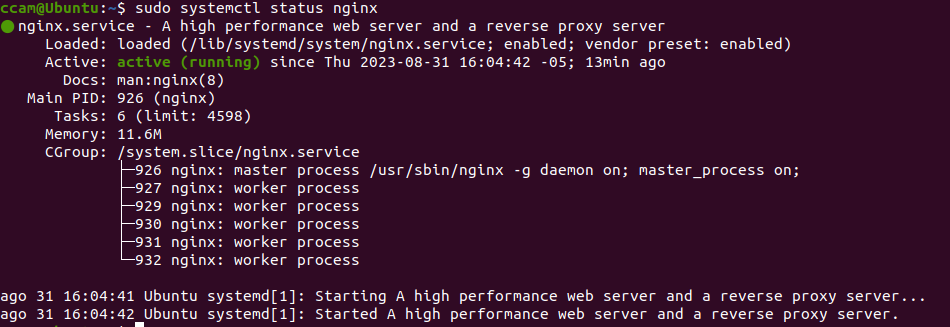


como prueba puedes modificar tu archivo index.html y ver el tu pagina en la web con http://tu_ip:80

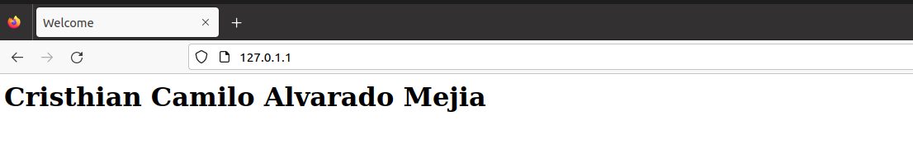


# Partición de Disco en Ubuntu con VirtualBox

## Índice

- [Introducción](#introducción-2)
- [Comandos](#comandos-2)
- [Proceso](#proceso-2)

## Introducción-2

La partición de disco es un paso esencial en la instalación de un sistema operativo. En el presente docuemnto aprenderemos cómo particionar un disco en una máquina virtual Ubuntu utilizando VirtualBox.

## Comandos-2

Aquí están los comandos que se utilizarán en este proceso:

```bash
# Listar los discos y sus particiones actuales
lsblk

# Iniciar el programa de particionado
sudo fdisk /dev/sdX  # Reemplazar sdX con el identificador de disco apropiado

# Crear una nueva partición (siguiendo las instrucciones del programa)

# Guardar los cambios y salir del programa

# Actualizar la tabla de particiones
sudo partprobe -s

# Crear un sistema de archivos ext4 en la partición
sudo mkfs.ext4 /dev/sdXY  # Reemplazar sdXY con el identificador de la partición

# Crear una carpeta para montar la partición
sudo mkdir /mnt/ext4

# Montar la partición en la carpeta
sudo mount /dev/sdXY /mnt/ext4  # Reemplazar sdXY con el identificador de la partición

# Desmontar la partición
sudo umount /mnt/ext4
```

## Proceso-2

1. **Crear disco en maquina virtual:**
    Ingresaremos a las configuraciones de la maquina virtual y ingresaremos a almacenamiento

    Una vez dentro crearemos un nuevo controlador SATA

    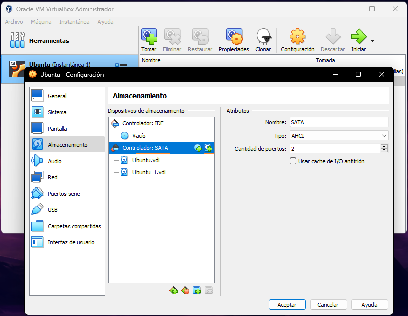

    una vez dentro creamos un nuevo disco he ingresamos el tamaño que le queramos dar 

    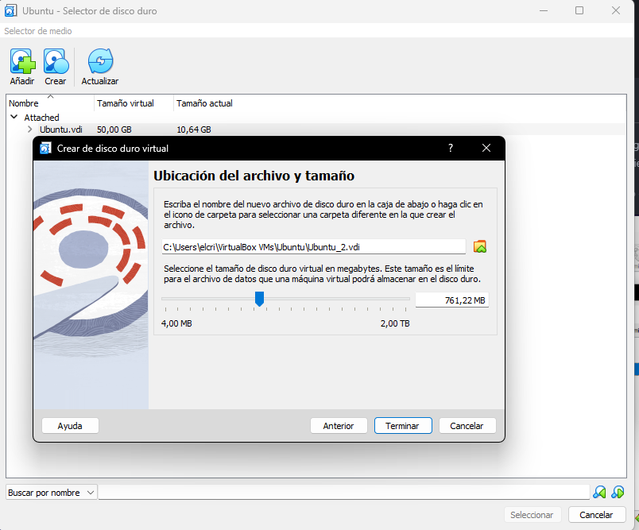

2. **Listar Discos y Particiones Actuales:**
   Ejecuta el siguiente comando para ver la lista de discos y particiones actuales en la máquina virtual.

   lsblk

   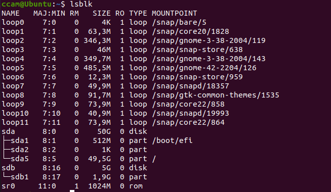

3. **Iniciar el Programa de Particionado:**
   Utiliza el comando siguiente para iniciar el programa de particionado en el disco deseado. Sustituye "sdX" con el identificador de disco correspondiente.

   sudo fdisk /dev/sdX

    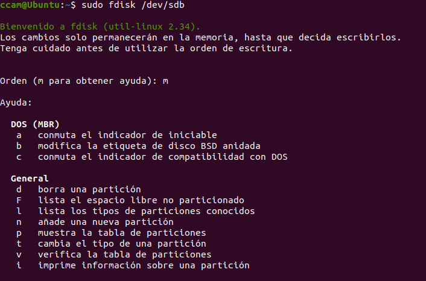
   
   ya creado solo debemos iniciar nuestra maquina virtual

4. **Crear una Nueva Partición:**
   Sigue las instrucciones del programa de particionado para crear una nueva partición en el disco. Esto puede incluir la especificación del tipo de partición, el tamaño, etc.

5. **Guardar Cambios y Salir:**
   Una vez hayas configurado la partición según tus necesidades, guarda los cambios y sale del programa de particionado.

6. **Crear Sistema de Archivos y Montar la Partición:**
   Utiliza los siguientes comandos para crear un sistema de archivos en la partición y montarla en una carpeta.

   
   para actualizar las particiones 

   sudo partprobe -s

   ahora como podemos ver no tenemos nuestro disco aun montado

   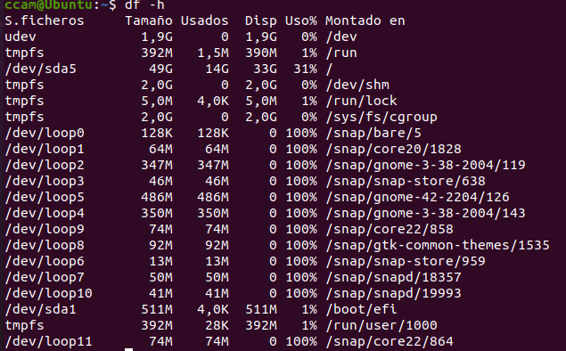

   mkdir /mnt/exat4

   mount /dev/sdb1 /mnt/ext4

   ahora podremos observar nuestro disco sdb1 montado

   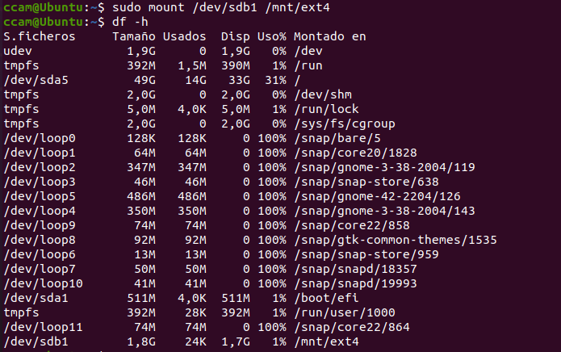

7. **Desmontar la Partición:**
   Cuando hayas terminado de trabajar con la partición, puedes desmontarla utilizando el siguiente comando.

   umount /mnt/ext4

   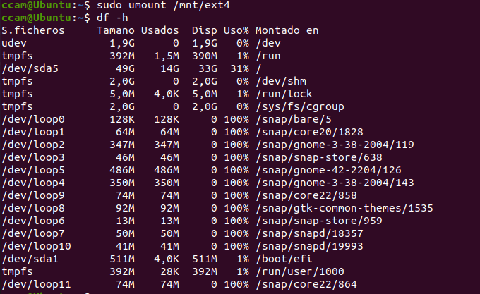
